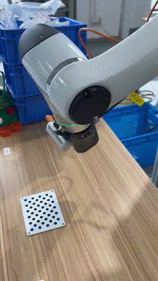

# Hand on eye calibration


**Wrote by Zhang Yiheng & Jie YU**

当然可以，以下是为您的项目设计的中文版 `README.md` 文件模板。这个模板包括了项目的目的、环境设置、运行脚本以及您上传的各个脚本和数据文件的描述。您可以根据项目的具体需求对内容进行调整。

# 项目标题

## 概览
本项目旨在通过多个 Python 脚本实现与机器人臂集成的摄像头系统的标定工作，处理图像与姿态数据采集、标定以及矩阵计算。

## 先决条件
- Python 3.x
- OpenCV
- NumPy
- PyYAML
- pyrealsense2
- tqdm

## 安装指南
确保安装所有必要的依赖，可以使用以下命令安装：

```bash
pip install numpy opencv-python pyyaml pyrealsense2 tqdm
```

## 文件结构
- `calibration_results.txt` - 存储摄像头标定结果的文本文件。
- `config.yaml` - 配置文件，包含摄像头参数和变换矩阵。
- `generate_positions.py` - 脚本用于生成和保存机械臂的位置数据。
- `load_calibration.py` - 加载和打印标定数据的脚本。
- `matrix_calculate.py` - 进行矩阵计算和摄像头标定的脚本。
- `pose_variation_capture.py` - 捕捉不同姿态下的图像和姿态数据的脚本。
- `random_generate_positions.py` - 生成随机机械臂位置的脚本。

## 使用说明
每个脚本都包含了详细的使用说明和命令行参数，可通过 Python 直接运行